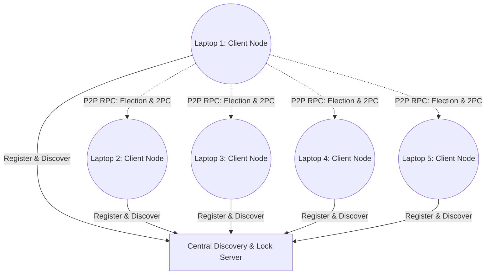

# Distributed Systems Case Study: Google Spanner

## Introduction
Google Spanner is a scalable, globally-distributed, and synchronously-replicated database. It is the first system to distribute data at a global scale while supporting externally-consistent distributed transactions. Spanner automatically shards data across many sets of Paxos state machines in datacenters all over the world.

### Architecture Diagram
Below is an architecture diagram modeling the implementation of this case study, taking inspiration from Spanner’s distributed nodes:



## Key Distributed Systems Concepts

### 1. Leader Election (Paxos in Spanner, Bully Algorithm in Code)
In Spanner, each set of replicated data (a "tablet") uses the Paxos consensus algorithm to elect a long-lived leader to manage replica states and handle writes. In our implementation, the distributed clients (laptops) perform **Leader Election using the Bully Algorithm**, negotiating amongst themselves over the network via Go RPC to decide which node coordinates transactions.

### 2. Mutual Exclusion (Distributed Locks)
For consistent atomic operations over distributed data, multiple actors must not blindly overwrite each other. Spanner uses 2-Phase Locking for concurrency control. In our simulated system, the **Central Server provides a Centralized Mutual Exclusion** algorithm. The elected leader must request and acquire a distributed lock from the server before starting a transaction, ensuring no two leaders (in case of a partitioned network split) can commit conflicting operations concurrently.

### 3. Extra marks Concept: Two-Phase Commit (2PC) over Paxos
Spanner uniquely provides distributed transactions across multiple Paxos groups using a **Two-Phase Commit (2PC)** protocol combined with TrueTime. The designated Paxos leader of the coordinating group acts as the 2PC Coordinator.
In our Go codebase, once a client is elected as the Leader and acquires the Mutual Exclusion lock, it acts as the **2PC Coordinator**. It runs the two phases:
1. **Prepare Phase**: The Leader sends a `Prepare` RPC to all other laptops (participants) asking if they can commit transaction \(T_i\).
2. **Commit Phase**: If all laptops vote `YES`, the Leader sends a `Commit` RPC to commit the transaction. If any vote `NO` or fail to respond, the Leader issues an `Abort`.

## Setup and Compilation

Before running the project locally or across multiple laptops, build the Go binaries for the server and client:

```bash

go build -o server_bin server/main.go

go build -o client_bin client/main.go
```

## How to Run Locally (Testing)

You can quickly test the distributed system on a single machine using the provided shell script. This script starts one central server and three clients locally.

```bash
chmod +x run_local_test.sh

./run_local_test.sh
```

## How to Run This Code on 5 Laptops

### 1. Setup the Server (Laptop A)
The server acts as the discovery node and locking mechanism.
```bash
go run server/main.go -port 8080
```
Note down Laptop A's IP address (e.g., `192.168.1.100`).

### 2. Setup the Clients (Laptops 1 to 5)
On each client laptop, run the client node. You must specify the `server` IP, the client's **own actual IP address** (`address`), and what `port` it will use.

```bash
# On Laptop 1 (Replace 192.168.1.101 with Laptop 1's actual IP)
go run client/main.go -server 192.168.1.100:8080 -address 192.168.1.101 -port 9001

# On Laptop 2 (Replace 192.168.1.102 with Laptop 2's actual IP)
go run client/main.go -server 192.168.1.100:8080 -address 192.168.1.102 -port 9002

# ... run similarly on all 5 laptops, ensuring they are on the same Wi-Fi/Network.
```

The clients will register with the Server, discover each other, automatically perform a Leader Election (Bully Algorithm), obtain a lock from the Server, and execute a fully functioning 2-Phase Commit across all laptops!